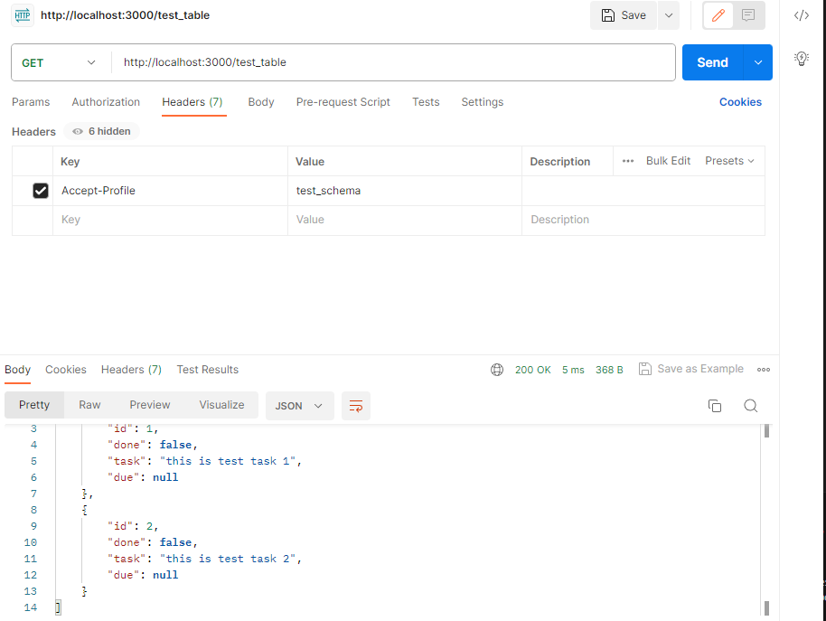

# UInnovate

## Setting up Docker

> :warning: Prior to following the steps below, ensure you have: <br/> 1. Installed Docker on your machine.
> <br/> 2. Cloned the repository.

### PostgreSQL server & pgAdmin containers

1. Open the repository in the code editor of your liking.
2. Make a copy of the file `.env.template`.
3. Rename the copy to `.env`.
4. Replace all the fields within '<>' by actual values (not keeping the <>). They can be any of your choosing.

   > 💡 Note that you don't have to create any account or credentials prior to this setup. It will be done automatically when you first run the containers.

5. Open a terminal window in the root directory of the repository (UInnovate).
6. Run `docker compose --profile tool up` to start the containers.  
   You can stop them at any time by running `docker compose --profile tool stop`.

   > 💡 Note that the pgadmin container will only be targeted by a docker compose command if you specify `--profile tool` as shown above. Otherwise, only the PostgreSQL and the PostgREST containers will be affected. Leaving it out can become handy if you try to reset the database, but you don't want to lose your server connection on pgadmin!

7. Run `.\refresh_database.sh` in your terminal to populate the db. (Note: \ on Windows, / on Linux)
   > 💡 Note: You may need to shut down the db and server containers and restart them after running the refresh database command. To do so, use `docker compose down && docker compose up  -d` in your terminal after the .\refresh_database.sh command
8. In a web browser window, access to localhost:5050
9. Log in to pgAdmin with the credentials you provided in your `.env` file.
10. On the home page, click on "Add New Server".
11. In the "General" tab, enter a Name for your local PostgreSQL server (e.g. "UInnovate Local PostgreSQL").
12. In the "Connection" tab, fill the fields with the following values :

    1. Host name/address: db (the name of the PostreSQL container)
    2. Port: 5432 (should be by default)
    3. Maintenance database: postgres (by default, leave untouched)
    4. Username: \<value of POSTGRES_USER in .env>
    5. Password: \<value of POSTGRES_PASSWORD in .env>

    Leave the other fields/settings untouched.

13. Press the save button.

14. You should be able to access the PostgREST API from `localhost:3000` on your browser: to view `table_x` in your database, you would go to
    `localhost:3000/table_x`

    Note: Because of the way PostgREST works, if you specified multiple schemas to be exposed in your compose file (`PGRST_DB_SCHEMAS`), you will only have direct
    access to the tables of the first schema specified. To have access to a table from say the 2nd schema (`schema_Y`), you will need to specify the `Accept-Profile` header in your GET request with the value `schema_Y` as shown in the Postman request below

    

You should be good to go now :smile:

## Getting Started

The set of steps to follow in order to run the app locally on your machine.

### Prerequisites

1. You will need a [stable](https://nodejs.org/en/download) version of Node.js, hence install the LTS version of Node.js.

2. Install NPM, if you don't have it already on your machine.

### Installation

1. If you already cloned the project during "Setting up Docker", you can omit this step.

```bash
git clone https://github.com/WillTrem/UInnovate.git
```

2. Open the project via your preferred editor/IDE and go to the project directory.

```bash
cd UInnovateApp
```

3. Install all the dependencies.

```bash
npm install
```

4. Start the server.

```bash
npm run dev
```

## Supported Testing

The supported types of tests are:

1. Unit Tests using Vitest
2. Integration Tests using Cypress
3. Component Tests using Cypress

### Unit Tests

The unit tests will be written using [Vitest](https://vitest.dev/guide/) in the `tests/unit` directory.

To run the unit tests

```bash
npm run test:unit
```

### Component Tests

The [component tests](https://docs.cypress.io/guides/component-testing/react/overview#React-with-Vite) will be handled by Cypress. These tests will be generated in the `cypress/component` directory.

To run component tests

```bash
npm run cy:run-component
```

To build component tests with Cypress Component Testing

```bash
npm run cy:open-component
```

### Integration Tests

The [integration tests](https://docs.cypress.io/guides/component-testing/react/overview#React-with-Vite) will be handled by Cypress. These tests will be generated in the `cypress/e2e` directory.

To run component tests

```bash
npm run cy:run-e2e
```

To build component tests with Cypress Component Testing

```bash
npm run cy:open-e2e
```

### Cypress Component Testing

To open directly the GUI of Cypress Component Testing for both component tests and E2E, run

```bash
npx cypress open
```

## Coverage Reports

Our current coverage reports only support Vitest unit tests by running

```bash
npm run coverage
```

## Start vite server and run cypress

To run the vite server and run the cypress application at the same time

```bash
npm run cy:e2e
```

## Available Scripts

You can run the following scripts with `npm run <script>`.

| Script              | Description                        |
| ------------------- | ---------------------------------- |
| `build`             | Builds the project for production. |
| `dev`               | Starts the development server.     |
| `preview`           | Preview of the application.        |
| `lint`              | Runs ESLint on the project.        |
| `test:unit`         | Runs unit tests.                   |
| `cy:open-component` | Opens component tests via GUI.     |
| `cy:run-component`  | Runs component tests.              |
| `cy:open-e2e`       | Opens E2E tests via GUI.           |
| `cy:run-e2e`        | Runs E2E tests.                    |
| `coverage`          | Coverage report for Vitest.        |

Additionally, you can run the script `npx cypress open`

## Refresh Database Script

The refresh_database.sh script allows for the application developer to
refresh the schema, tables, and data within the database. To run the
refresh script, follow the steps below:

1. Open a terminal
2. Change directories to the UInnovate folder where the refresh_database.sh is located
3. From a terminal, run:
   💡 .\refresh_database.sh

4. A log file will be generated to see everything that was done to the DB and any errors that occurred

## Postman Endpoint Testing

To use Postman for testing the PostgREST API corrrectly accessing the database:

1. Have Postman downloaded on your local machine, with an account created.
2. Join the Team Workspace using the invite link below:
   https://app.getpostman.com/join-team?invite_code=daa40b2dc66c40aca34c410ded3642a0&target_code=0ad2148deff37d1bc2ab282720715240
   > Note: there is a 3-person/teamspace limitation on Postman without a premium account. We'll look into this later.
3. Once inside the teamspace, navigate to Collections to see the current tests and run them.
