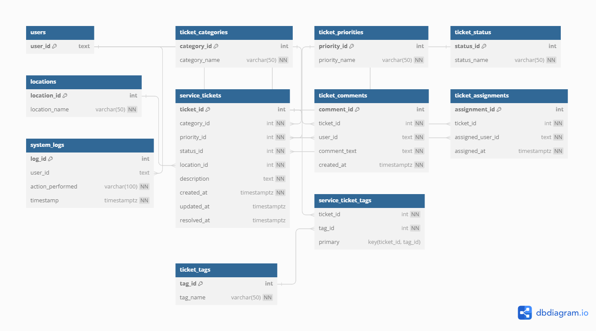

# Use Case 2 Documentation

## Database Functions

### add_ticket_comment

#### Parameters

- **p_ticket_id (INT):** The ID of the service ticket.
- **p_user_id (TEXT):** The ID of the user adding the comment.
- **p_comment_text (TEXT):** The text of the comment.

#### Returns

- **TEXT:** A success message if the comment is added successfully, otherwise an error message.

#### Description

Adds a comment to a service ticket in the `app_service_support.ticket_comments` table.

#### API URL:
http://localhost:3000/rpc/add_ticket_comment

json param example:

`{
    "p_ticket_id":1,
    "p_user_id":"user2@test.com",
    "p_comment_text": "This is a test comment"
}`

---

### assign_ticket

#### Parameters

- **p_ticket_id (INT):** The ID of the service ticket.
- **p_assigned_user_id (TEXT):** The ID of the user to whom the ticket is assigned.

#### Returns

- **TEXT:** A success message if the ticket is assigned successfully, otherwise an error message.

#### Description

Assigns a service ticket to a user in the `app_service_support.ticket_assignments` table.

#### API URL:
http://localhost:3000/rpc/assign_ticket

json param example:

`{
    "p_ticket_id": 5,
    "p_assigned_user_id": "user35@test.com"
}`

---

### get_ticket_comments

#### Parameters

- **p_ticket_id (INT):** The ID of the service ticket.

#### Returns

- **comment_id (INT):** The ID of the comment.
- **user_id (TEXT):** The ID of the user who added the comment.
- **comment_text (TEXT):** The text of the comment.
- **created_at (TIMESTAMPTZ):** The timestamp when the comment was created.

#### Description

Retrieves all comments for a specific service ticket.

#### API URL:
http://localhost:3000/rpc/get_ticket_comments

json param example:

`{
    "p_ticket_id": 1
}`

---

### get_assigned_tickets

#### Parameters

- **p_assigned_user_id (TEXT):** The ID of the user to whom tickets are assigned.

#### Returns

- **ticket_id (INT):** The ID of the service ticket.
- **user_id (TEXT):** The ID of the user who created the ticket.
- **category_id (INT):** The ID of the ticket category.
- **priority_id (INT):** The ID of the ticket priority.
- **status_id (INT):** The ID of the ticket status.
- **location_id (INT):** The ID of the issue location.
- **description (TEXT):** The description of the service ticket.
- **created_at (TIMESTAMPTZ):** The timestamp when the ticket was created.
- **updated_at (TIMESTAMPTZ):** The timestamp when the ticket was last updated.
- **resolved_at (TIMESTAMPTZ):** The timestamp when the ticket was resolved.

#### Description

Retrieves all service tickets assigned to a specific user.

#### API URL:
http://localhost:3000/rpc/get_assigned_tickets

json param example:

`{
    "p_assigned_user_id":"user2@test.com"
}`

---

### add_ticket_tag

#### Parameters

- **p_ticket_id (INT):** The ID of the service ticket.
- **p_tag_name (VARCHAR(50)):** The name of the tag.

#### Returns

- **TEXT:** A success message if the tag is added successfully, otherwise a message indicating existing association.

#### Description

Adds a new record to the `app_service_support.ticket_tags` table, associating a tag with a service ticket.

#### API URL:
http://localhost:3000/rpc/add_ticket_tag

json param example:

`{
    "p_ticket_id": 1,
    "p_tag_name": "MyNewTagName"
}`

---

### remove_ticket_tag

#### Parameters

- **p_ticket_id (INT):** The ID of the service ticket.
- **p_tag_name (VARCHAR(50)):** The name of the tag.

#### Returns

- **TEXT:** A success message if the tag is removed successfully, deleted successfully, or not associated. 

#### Description

Removes a tag from a service ticket and deletes it if not associated with any other ticket.

#### API URL:
http://localhost:3000/rpc/remove_ticket_tag

json param example:

`{
    "p_ticket_id": 1,
    "p_tag_name": "MyNewTagName"
}`

---

## Triggers

### notify_ticket_change

#### Description

A trigger function that logs changes to the `app_service_support.service_tickets` table. It logs when a new ticket is added or an existing ticket is updated.

### notify_comment_change

#### Description

A trigger function that logs changes to the `app_service_support.ticket_comments` table. It logs when a comment is added, updated, or deleted.

## Unit Tests

To run the unit test using pgTap navigate to script folder and run command :

`./refresh_database.sh -f '/useCase2' -rt true`

---

# ER Diagram

