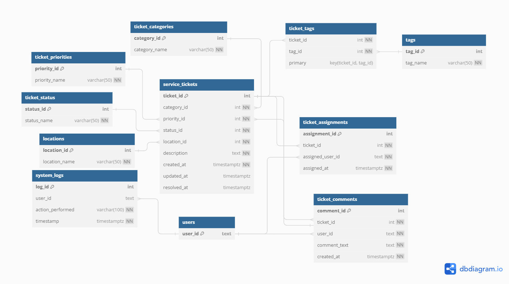

# Use case 2 Documentation

## Database Functions

### create_service_ticket

#### Parameters

- **p_user_id (TEXT):** The ID of the user creating the service ticket.
- **p_category_id (INT):** The ID of the ticket category.
- **p_priority_id (INT):** The ID of the ticket priority.
- **p_status_id (INT):** The ID of the ticket status.
- **p_location_id (INT):** The ID of the issue location.
- **p_description (TEXT):** The description of the service ticket.

#### Returns

- **VOID**

#### Description

Creates a new service ticket in the `app_service_support.service_tickets` table.

---

### add_ticket_comment

#### Parameters

- **p_ticket_id (INT):** The ID of the service ticket.
- **p_user_id (TEXT):** The ID of the user adding the comment.
- **p_comment_text (TEXT):** The text of the comment.

#### Returns

- **TEXT:** A success message if the comment is added successfully, otherwise an error message.

#### Description

Adds a comment to a service ticket in the `app_service_support.ticket_comments` table.

---

### assign_ticket

#### Parameters

- **p_ticket_id (INT):** The ID of the service ticket.
- **p_assigned_user_id (TEXT):** The ID of the user to whom the ticket is assigned.

#### Returns

- **TEXT:** A success message if the ticket is assigned successfully, otherwise an error message.

#### Description

Assigns a service ticket to a user in the `app_service_support.ticket_assignments` table.

---

### get_ticket_comments

#### Parameters

- **p_ticket_id (INT):** The ID of the service ticket.

#### Returns

- **comment_id (INT):** The ID of the comment.
- **user_id (TEXT):** The ID of the user who added the comment.
- **comment_text (TEXT):** The text of the comment.
- **created_at (TIMESTAMPTZ):** The timestamp when the comment was created.

#### Description

Retrieves all comments for a specific service ticket.

---

### get_assigned_tickets

#### Parameters

- **p_assigned_user_id (TEXT):** The ID of the user to whom tickets are assigned.

#### Returns

- **ticket_id (INT):** The ID of the service ticket.
- **user_id (TEXT):** The ID of the user who created the ticket.
- **category_id (INT):** The ID of the ticket category.
- **priority_id (INT):** The ID of the ticket priority.
- **status_id (INT):** The ID of the ticket status.
- **location_id (INT):** The ID of the issue location.
- **description (TEXT):** The description of the service ticket.
- **created_at (TIMESTAMPTZ):** The timestamp when the ticket was created.
- **updated_at (TIMESTAMPTZ):** The timestamp when the ticket was last updated.
- **resolved_at (TIMESTAMPTZ):** The timestamp when the ticket was resolved.

#### Description

Retrieves all service tickets assigned to a specific user.

---

# ER Diagram

