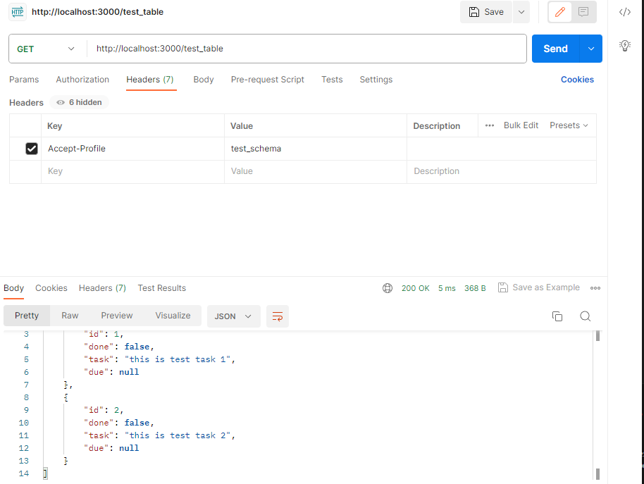

# Setting up your PostGOAT app locally on your machine

## Setting up Docker

> Prior to following the steps below, ensure you have: <br/> 1. Installed Docker on your machine.
> <br/> 2. Cloned the repository.

### PostgreSQL server & pgAdmin containers

1. Open the repository in the code editor of your liking.
2. Make a copy of the file `.env.template`.
3. Rename the copy to `.env`.
4. Replace all the fields within '<>' by actual values (not keeping the <>). They can be any of your choosing.
   > 💡 Note that you don't have to create any account or credentials prior to this setup. It will be done automatically when you first run the containers.
5. Add the domain(s) where your PostGOAT instance(s) run from to the PLATFORM_DOMAIN environment variable in `.env`. Example:
    ```
    PLATFORM_DOMAIN=http://localhost:5173, http://localhost:8080
    ```
   > ⚠️ Ensure that you don't put an extra `/` at the end of your domain(s), as they will not be recognized that way.

6. Run the `generate_jwt_secret.sh` script. This should add a JWT_SECRET to your .env file. Leave it as is.
7. Open a terminal window in the root directory of the repository (UInnovate).
8. Run `docker compose --profile tool up` to start the containers.  
   You can stop them at any time by running `docker compose --profile tool stop`.
   > 💡 Note that the pgadmin container will only be targeted by a docker compose command if you specify `--profile tool` as shown above. Otherwise, only the PostgreSQL and the PostgREST containers will be affected. Leaving it out can become handy if you try to reset the database, but you don't want to lose your server connection on pgadmin!

### Starting up the Usecase databases

1.  Run `./db.sh -r` from the scipting folder in your terminal to populate the db with the default use case. (Note: \ on Windows, / on Linux AND add `-f '/useCaseXYZ'` to specify a different use case folder. ex: `./db.sh -r -f '/useCase1'` )
   > 💡 Note: To run bash commands on windows you need to:
    - Enable WSL on window
    - A linux distro installed from the windows store
    - see this [link](https://www.thetechedvocate.org/how-to-install-and-run-bash-on-windows-11/) or [video](https://youtu.be/sUsTQTJFmjs?si=qx6QiqUiYSZ8W-6U) for more help
     > 💡 Note: You may run into this error "The command 'docker' could not be found in this WSL 2 distro.""
    - Update your docker desktop to the latest version.
    - Go to Settings > Resources > WSL integration > check "Enable integration with my default WSL distro" or manually toggle the linux distro from the list
     > 💡 Note: You may need to shut down the db and server containers and restart them after running the refresh database command. To do so, use `docker compose stop && docker compose up  -d` in your terminal after the `./db.sh -r` command
2. In a web browser window, access to localhost:5050
3. Log in to pgAdmin with the credentials you provided in your `.env` file.
4. On the home page, click on "Add New Server".
5. In the "General" tab, enter a Name for your local PostgreSQL server (e.g. "UInnovate Local PostgreSQL").
6. In the "Connection" tab, fill the fields with the following values :

    1. Host name/address: db (the name of the PostreSQL container)
    2. Port: 5432 (should be by default)
    3. Maintenance database: postgres (by default, leave untouched)
    4. Username: \<value of POSTGRES_USER in .env>
    5. Password: \<value of POSTGRES_PASSWORD in .env>

    Leave the other fields/settings untouched.

7. Press the save button.

8. You should be able to access the PostgREST API from `localhost:3000` on your browser: to view `table_x` in your database, you would go to
    `localhost:3000/table_x`

    Note: Because of the way PostgREST works, if you specified multiple schemas to be exposed in your compose file (`PGRST_DB_SCHEMAS`), you will only have direct
    access to the tables of the first schema specified. To have access to a table from say the 2nd schema (`schema_Y`), you will need to specify the `Accept-Profile` header in your GET request with the value `schema_Y` as shown in the Postman request below

    

You should be good to go now

## Getting Started

The set of steps to follow in order to run the app locally on your machine.

### Prerequisites

1. You will need a [stable](https://nodejs.org/en/download) version of Node.js, hence install the LTS version of Node.js.

2. Install NPM, if you don't have it already on your machine.

### Installation

1. If you already cloned the project during "Setting up Docker", you can omit this step.

```bash
git clone https://github.com/WillTrem/UInnovate.git
```

2. Open the project via your preferred editor/IDE and go to the project directory.

```bash
cd UInnovateApp
```

3. Install all the dependencies.

```bash
npm install
```

4. Start the server.

```bash
npm run dev
```